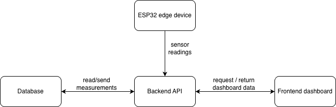

# Architecture

## Purpose
The purpose of the system is to collect sensor data that can later be used as part of energy meassurement system

## System Context
User
- Home owner interacting with the system
Home enviorment
- Has sensores that meassures data
Smart Home Energy System
- Handles, stores and communicates data

## Main Components
Frontend
- Shows dashboard
Backend
- Receives data and sends it forward
Database
- Stores data
ESP32-program
- Measures sensor data and sends it

## Data Flow
Measurement flow:
ESP32 -> Backend -> Database

Display flow:
Frontend -> Backend -> Database > Backend -> Frontend

ESP32 -> Backend:
meassurements from sensors, device id, timestamp

Backend -> Database:
validatet measurement data
 
Frontend -> Backend:
requests for values

Backend -> Frontend:
values for dashboard

## Key Design Decisions

## Asssumptions
- The ESP32 will send sensor readings to the backend.
- The backend will be responsible for storing data.
- The frontend will not communicate directly with the database.
- Energy usage may require additional hardware or an external dat source.

## Open Questions
Should the ESP32 communicate with the backend using HTTP or MQTT?
Should the backend run locally or in the cloud?
Which database should be used?
Should the frontend show live values or historical values?

## What i dont understand
I dont know fully what MQTT is and how it works.